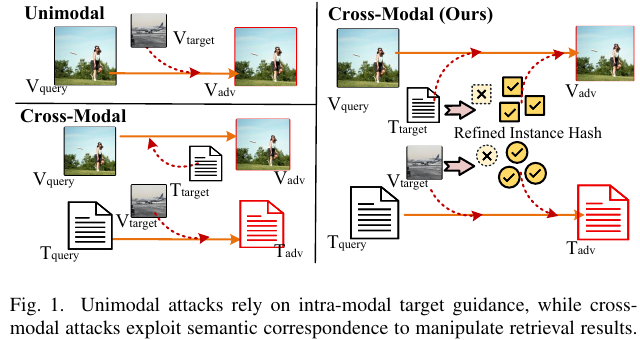
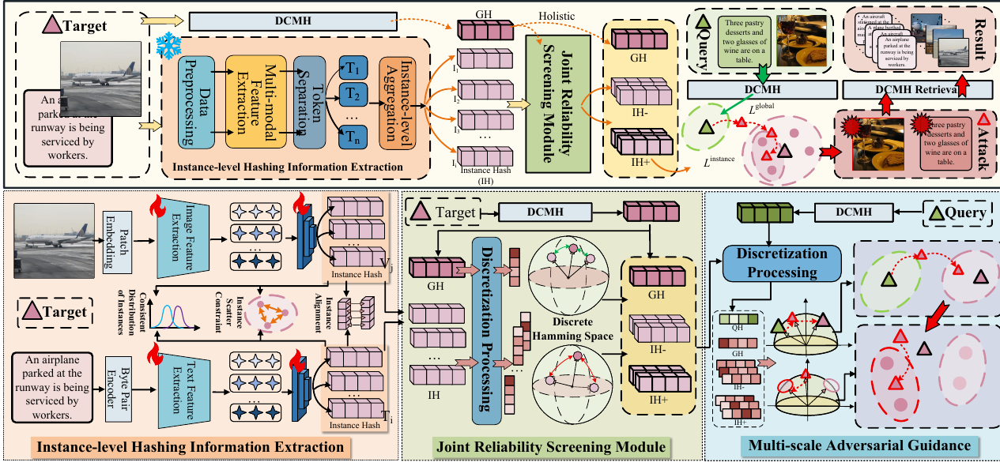
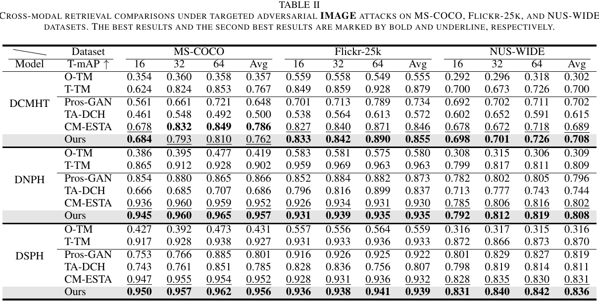
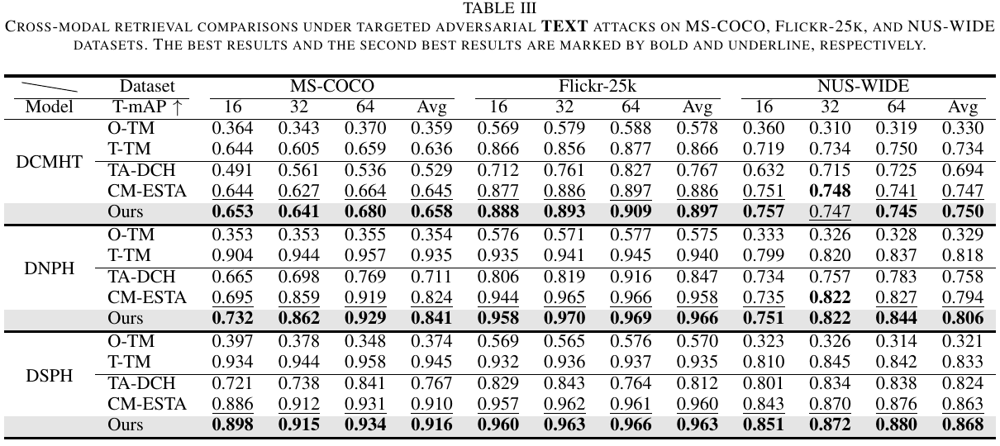
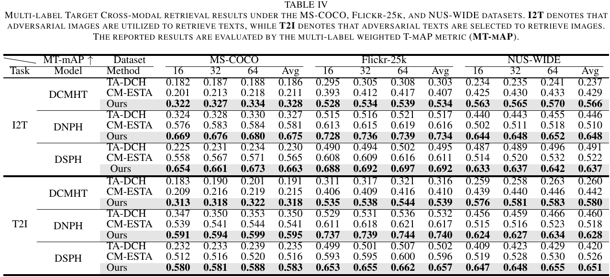

# HIMA 🚀

**HIMA: Holistic-to-Instance Multi-scale Targeted Attacks against Deep Cross-Modal Hashing Retrieval**

> This repository currently provides a preview implementation. The complete HIMA attack objective, reliability-aware instance screening, and full experimental scripts will be released after paper acceptance.

## 📌 Introduction

Deep cross-modal hashing (DCMH) maps images and texts into a shared compact Hamming space for efficient large-scale image-text retrieval. While DCMH is effective for retrieval, recent studies show that adversarial perturbations can manipulate the returned results, especially under targeted attack settings.

HIMA studies targeted adversarial attacks against DCMH retrieval. Existing targeted attacks often guide optimization with a holistic target representation, such as a global semantic hash or class prototype. However, real cross-modal targets may contain multiple semantic components. Compressing them into one global target can produce ambiguous attack directions and may only move the adversarial query toward a coarse target region.

## 🎯 Motivation



Targeted cross-modal attacks are more challenging than unimodal targeted attacks because the adversarial query and the target may come from different modalities. HIMA addresses this by refining holistic target guidance with instance-level hash anchors, allowing the attack to move from coarse semantic attraction toward fine-grained target localization in the shared Hamming space.

## 🧩 Method Overview



HIMA follows a holistic-to-instance multi-scale attack strategy:

- **Instance-level Hash Refinement (IHIR):** a frozen auxiliary instance-aware hashing module extracts multiple latent instance-level hash anchors from the target sample.
- **Reliability-aware Instance Screening:** candidate anchors are filtered according to their consistency with the holistic target direction, suppressing unstable or background-related instance signals.
- **Multi-scale Hamming Alignment:** the attack objective combines holistic target alignment with reliable instance-level anchors, guiding adversarial optimization from global target attraction to fine-grained instance matching.

During adversarial sample generation, the victim DCMH model and the IHIR module are fixed. Only the input query is optimized under a perturbation constraint.

## 📊 Experimental Results

The experiments cover multiple representative victim DCMH models, including DCMHT, DNPH, and DSPH, and evaluate both image-to-text and text-to-image targeted attack settings.

### 🖼️ Targeted Adversarial Image Attacks



### 📝 Targeted Adversarial Text Attacks



### 🧮 Multi-label Weighted Targeted Retrieval Results (MT-mAP)



These results are reported for research reference only while the paper is unpublished.

## ⚙️ Code Usage

This repository currently keeps the public preview structure of HIMA. The main interfaces, module layout, and attack pipeline entry points are retained, while the complete reliability-aware screening strategy, multi-scale attack objective, datasets, checkpoints, and full experimental scripts will be released after paper acceptance.

Current public components:

- `main.py`: preview entry point for the attack pipeline.
- `attack/`: attack pipeline skeleton, preview HIMA objective, and shared attack base classes.
- `model/`: CLIP-based hashing modules and the IHIR implementation.
- `attacked/`: victim DCMH model implementations and configurations.
- `utils/`: arguments, logging, and evaluation utilities.

The preview attack file keeps the same function signatures as the full implementation. Core unpublished parts are represented by deterministic placeholders so the project structure remains clear without exposing the complete method before acceptance.

Preview entry:

```bash
python main.py
```

Running the full experiments requires the private dataset preparation code, CLIP checkpoint, victim model checkpoints, and the complete HIMA attack implementation, which are intentionally not included in this preview release.
